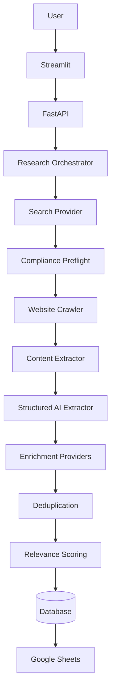
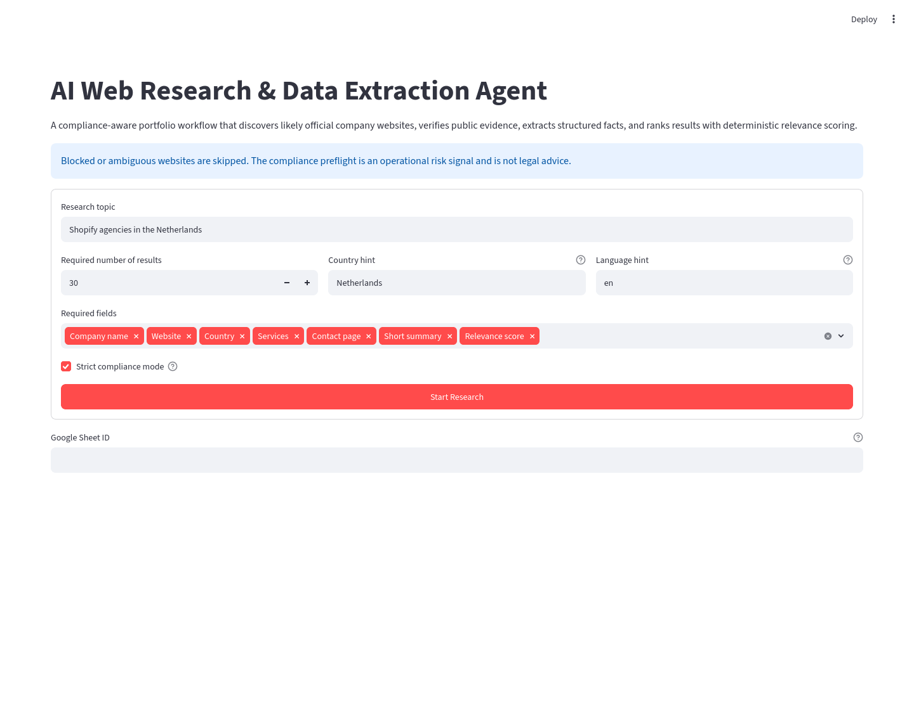

# AI Web Research & Data Extraction Agent

A portfolio project that turns a research brief into a ranked, auditable
dataset of companies. It combines policy-aware source discovery, bounded
website crawling, evidence-based extraction, enrichment, entity resolution,
deterministic scoring, persistence, and export behind FastAPI and Streamlit.

## Project overview

The example brief—“Shopify agencies in the Netherlands”—looks simple, but a
useful answer needs more than a list of links. Each company must be identified
from its official website, checked against source and robots policies, supported
with evidence, deduplicated, scored consistently, and accompanied by a report
of sources that could not safely be used.

This project models that complete workflow. Search results are discovery hints,
not facts. Only site-verified, evidence-bearing company records reach the
database or an export; this validates provenance, not the truth of a company's
own claims. Failures are isolated per domain, allowing a run to complete with
partial results and explicit warnings.

## Problem statement

Manual company research is slow and difficult to reproduce. Naive automation
can be faster, but commonly loses provenance, repeats the same company under
different names, invents unsupported values, retains restricted search data, or
fetches websites without checking their published controls.

The agent is designed around three goals:

1. Produce structured data whose fields can be traced to evidence URLs.
2. Make source, compliance, merge, and relevance decisions explainable.
3. Keep providers replaceable so API, model, enrichment, storage, and export
   choices can change without rewriting the workflow.

## Key features

- Asynchronous, replaceable search-provider integration and deterministic query
  planning.
- Configurable approved, blocked, candidate-review, exact-domain, and subdomain
  policies.
- Robots and terms-risk preflight before bounded same-domain website crawling.
- English and Dutch page discovery with clean, source-attributed content
  extraction.
- Deterministic extraction first, followed by optional strict-schema LLM
  extraction that rejects unsupported fields.
- Evidence-preserving OpenCorporates, Wikidata, and GeoNames enrichment.
- Explainable entity resolution and deterministic relevance scoring from
  0–100.
- Partial-success orchestration with progress events and skipped-source audit
  records.
- UUID-based UTC persistence with SQLite locally, PostgreSQL compatibility, and
  Alembic migrations.
- FastAPI endpoints, a Streamlit dashboard, CSV download, and formatted Google
  Sheets export.
- Offline unit and integration tests, opt-in live smoke checks, Docker Compose,
  and GitHub Actions quality checks.

## Architecture



The Streamlit client submits a validated brief to FastAPI and polls a background
research run. `ResearchOrchestrator` plans queries, keeps discovered candidates
transient, and advances each likely official website through policy, crawling,
content, extraction, enrichment, resolution, and scoring stages. Repository
interfaces persist final verified records and run state. Skipped candidate URLs
are persisted only when `SEARCH_RESULT_RETENTION_ALLOWED=true`. Relevance,
warnings, progress events, and export context remain process-local.

Progress events expose `planning`, `searching`, `validating`,
`checking_compliance`, `crawling`, `extracting`, `enriching`,
`deduplicating`, `scoring`, `exporting`, and terminal states without coupling
the UI to implementation details.

### Provider-based design

External capabilities sit behind typed interfaces:

- `SearchProvider` discovers transient candidates; Brave and fake adapters are
  included.
- `LLMProvider` supplies strict structured responses without owning extraction
  validation.
- `StructuredDataExtractor` supports deterministic, LLM, and composite
  strategies.
- `CompanyEnrichmentProvider` supports official OpenCorporates, Wikidata, and
  GeoNames endpoints.
- Repository interfaces separate orchestration from SQLAlchemy persistence.
- `ResultExporter` separates research from Google Sheets delivery.

Fake providers and local HTML fixtures exercise the same orchestration contract
without paid calls or live network access. A new vendor adapter can therefore
be added at the boundary instead of being embedded in route handlers or domain
services.

### Compliance-first boundaries

The project intentionally applies conservative operational boundaries:

- Google and Bing result pages are not scraped. Discovery uses a configured
  official search API.
- The Shopify Partner Directory is not scraped.
- LinkedIn, Clutch, and Crunchbase are blocked by default, alongside other
  configured high-risk sources.
- Search API responses and snippets are transient unless the operator has
  configured appropriate retention rights and implemented an allowed storage
  path.
- In strict mode, company websites require explicit policy approval before
  content access.
- The application never bypasses authentication, CAPTCHA, `robots.txt`, rate
  limits, or technical access restrictions.
- Extracted data includes evidence URLs, and unsupported required fields reject
  a record.
- Source-policy, robots, and terms checks are engineering risk controls, not
  legal advice.

## Requirements

- Python 3.12–3.14 (Python 3.12 is used in Docker and CI)
- GNU Make (optional)
- Docker with Docker Compose (optional)
- PostgreSQL for the Docker stack; SQLite is the local default

## Installation

```bash
python3.12 -m venv .venv
source .venv/bin/activate
python -m pip install --upgrade pip
python -m pip install -e ".[dev]"
```

Copy the environment template for local configuration:

```bash
cp .env.example .env
```

## Environment variables

All settings are loaded from environment variables through Pydantic Settings.
The committed [`.env.example`](.env.example) is the complete template; `.env`
is ignored by Git and must contain only local values.

| Area | Variables | Purpose |
| --- | --- | --- |
| Runtime | `APP_ENV`, `LOG_LEVEL`, `PROJECT_USER_AGENT`, `API_ACCESS_TOKEN` | Environment, structured-log level, descriptive network identity, and optional write-endpoint bearer authentication |
| Database | `DATABASE_URL` | SQLAlchemy SQLite or PostgreSQL connection URL |
| Docker database | `POSTGRES_DB`, `POSTGRES_USER`, `POSTGRES_PASSWORD`, `COMPOSE_DATABASE_URL` | Runtime-only Compose database initialization and API connection |
| Source policy | `SOURCE_POLICY_CONFIG_DIR`, `ROBOTS_STRICT_MODE`, `ROBOTS_CACHE_TTL_SECONDS`, `COMPLIANCE_HTTP_TIMEOUT_SECONDS`, `TERMS_MAX_DOCUMENTS` | Policy files and compliance behavior |
| Search | `BRAVE_SEARCH_API_KEY`, `SEARCH_RESULT_RETENTION_ALLOWED`, `SEARCH_TIMEOUT_SECONDS`, `SEARCH_MAX_RETRIES`, `SEARCH_BACKOFF_SECONDS` | Official Brave API access and bounded retries |
| Extraction | `HTML_CONTENT_MAX_CHARS`, `LLM_PROVIDER`, `LLM_MODEL`, `LLM_API_URL`, `LLM_API_KEY`, `LLM_MAX_INPUT_CHARS` | Clean-text limits and optional model provider |
| Research and crawl | `RESEARCH_SEARCH_BUDGET`, `RESEARCH_SEARCH_PAGE_SIZE`, `RESEARCH_CRAWL_PAGE_LIMIT`, `CRAWLER_REQUEST_DELAY_SECONDS`, `CRAWLER_MAX_RESPONSE_BYTES`, `CRAWLER_TIMEOUT_SECONDS` | Work budgets and crawler limits |
| Enrichment | `OPENCORPORATES_*`, `WIKIDATA_*`, `GEONAMES_*` | Optional official enrichment endpoints, licensing gates, retry, and cache settings |
| Google Sheets | `GOOGLE_SERVICE_ACCOUNT_FILE`, `GOOGLE_SERVICE_ACCOUNT_JSON`, `GOOGLE_SHEETS_*` | Service-account credentials, target sheet, creation permission, and retries |
| UI and live tests | `UI_API_BASE_URL`, `UI_API_ACCESS_TOKEN`, `RUN_LIVE_WEBSITE_SMOKE_TESTS` | Dashboard API endpoint, matching optional API bearer token, and explicit live-test opt-in |

Blank optional credentials disable their providers. Keep secrets in `.env`, CI
secrets, or a deployment secret manager; they are never required in an image
or committed configuration. `API_ACCESS_TOKEN` is mandatory when Brave Search
or Google service-account credentials are configured.

## Local development

After installation and `make migrate`, start the applications in two terminals.

Start the API:

```bash
make run-api
```

Start the Streamlit UI in another terminal:

```bash
make run-ui
```

The health endpoint is available at `http://localhost:8000/health`.
The versioned health endpoint is available at
`http://localhost:8000/api/health`, interactive OpenAPI documentation is at
`http://localhost:8000/docs`, and Streamlit is at
`http://localhost:8501`.

## Database migrations

SQLite is suitable for local development. Configure `DATABASE_URL` with a
`postgresql+psycopg://` URL for PostgreSQL. Apply the committed schema:

```bash
make migrate
```

Useful Alembic commands:

```bash
alembic current
alembic history
alembic upgrade head
alembic downgrade -1
```

Create a reviewed migration after changing persistence models:

```bash
make migration message="describe schema change"
```

## Docker development environment

Docker Compose runs PostgreSQL, FastAPI, and Streamlit together. Copy the
ignored environment file and set the four blank Docker database variables:

```bash
cp .env.example .env
```

Choose local values for `POSTGRES_DB`, `POSTGRES_USER`, and
`POSTGRES_PASSWORD`. Set `COMPOSE_DATABASE_URL` to the matching SQLAlchemy URL:

```text
postgresql+psycopg://<url-encoded-user>:<url-encoded-password>@postgres:5432/<database>
```

The values belong only in the git-ignored `.env` file or your runtime secret
store; do not add them to an image or commit them. Provider credentials can
also be supplied through the same local environment file and are passed only
to the API service. Streamlit receives only its API URL and optional API access
token, never search, LLM, enrichment, database, or Google credentials.

For file-based Google credentials, place the ignored JSON file under
`.secrets/` and set `GOOGLE_SERVICE_ACCOUNT_FILE` to its container path, for
example `/run/secrets/google-service-account.json`.

Build and start the development stack:

```bash
make docker-up
```

FastAPI applies Alembic migrations after PostgreSQL becomes healthy, then
starts with reload enabled. Streamlit waits for the API health check. The
services are available at:

- FastAPI: `http://localhost:8000`
- OpenAPI: `http://localhost:8000/docs`
- Streamlit: `http://localhost:8501`

Override host ports with `API_PORT` and `STREAMLIT_PORT`. Source directories
are bind-mounted for development reloads, while PostgreSQL data is retained in
the `postgres-data` named volume.

Useful development commands:

```bash
make docker-ps
make docker-logs
make docker-down
```

`docker compose down` preserves database data. To intentionally remove the
local database volume, use `docker compose down --volumes`.

## Example research request

Research runs are asynchronous. `POST /api/research-runs` validates the topic,
requested fields, result count, and locale, returns `202 Accepted`, and provides
a UUID for progress polling through `GET /api/research-runs/{run_id}`.
Verified results and skipped-source audit records are available from the
run-specific `/results` and `/skipped-sources` endpoints. Results support
`offset` and `limit` pagination and remain available when a run finishes with
partial success.

```bash
curl -X POST http://localhost:8000/api/research-runs \
  -H 'Content-Type: application/json' \
  -H 'X-Request-ID: portfolio-demo-1' \
  -d '{
    "topic": "Shopify agencies in the Netherlands",
    "requested_fields": [
      {"name": "country"},
      {"name": "services"},
      {"name": "contact page"}
    ],
    "result_count": 30,
    "location": "Netherlands",
    "country": "NL",
    "language": "en",
    "country_tld": "nl"
  }'
```

If `API_ACCESS_TOKEN` is configured, add
`-H 'Authorization: Bearer <your-token>'`. Set the matching
`UI_API_ACCESS_TOKEN` for Streamlit.

Poll the returned run ID and then request
`GET /api/research-runs/{run_id}/results`. An illustrative response is shown
below; the `.example` company is fictional and is not an endorsement or a
captured live result.

```json
{
  "run_id": "6f9619ff-8b86-4d11-b42d-00cf4fc964ff",
  "items": [
    {
      "id": "2f5ad4b6-8ac3-42c4-99e3-0f3d58cb48cc",
      "company_name": "Example Commerce Studio",
      "website": "https://commerce-studio.example/",
      "country": "Netherlands",
      "services": [
        "Shopify development",
        "Shopify Plus implementation"
      ],
      "contact_page": "https://commerce-studio.example/contact",
      "short_summary": "A Netherlands-based studio providing evidence-backed Shopify development and Shopify Plus implementation services.",
      "relevance_score": 91,
      "relevance_explanation": [
        "Shopify services are explicitly supported by official-site evidence.",
        "The Netherlands location is explicitly supported by official-site evidence.",
        "A public business contact page was verified."
      ],
      "evidence_urls": [
        "https://commerce-studio.example/services/shopify",
        "https://commerce-studio.example/about",
        "https://commerce-studio.example/contact"
      ],
      "compliance_status": "approved",
      "validation_warnings": [],
      "retrieved_at": "2026-07-30T10:15:00Z"
    }
  ],
  "total": 1,
  "offset": 0,
  "limit": 100,
  "partial": true
}
```

Each extracted value is admitted only when the extractor can associate it with
allowed evidence. The compact API response returns the combined evidence URL
set. Runtime extraction models retain field-level attribution, confidence,
method, and compact evidence fragments; persistence currently retains values,
confidence, evidence URLs, and compact excerpts, but not basis/method enums.

Every response includes `X-Request-ID`; a safe caller-provided value is
preserved. Validation, missing-run, lifecycle-conflict, provider, and internal
failures use a consistent `error` envelope. Error responses and
`GET /api/config/providers` expose provider readiness but never credential
values.

After a run reaches a terminal state,
`POST /api/research-runs/{run_id}/export/google-sheets` exports its final or
partial records using the configured Google Sheets service account.

## Offline portfolio demo

The committed
[`config/demo_shopify_agencies.yaml`](config/demo_shopify_agencies.yaml)
captures the 30-result Shopify agencies brief, all seven requested fields, the
ten example search queries, and the ordered Google Sheets tab structures.

For presentations without provider credentials or network access, the
[`demo`](demo/README.md) directory includes 30 synthetic results and CSV
previews of `Research Results`, `Skipped Sources`, and `Run Metadata`.

> **DEMO DATA:** Every company name, domain, evidence URL, summary, decision,
> and score in these fixtures is fictional. Reserved `.example` domains and
> prominent per-record warnings prevent the dataset from being mistaken for
> verified research. No unverified real company appears in the demo.

The typed demo loader rejects non-`.example` sources, missing fictional-data
warnings, mismatched result counts, duplicate fields or queries, and malformed
sheet definitions. Tests keep the fixture aligned with the canonical request.
Demo records are presentation assets and are never loaded into production
repositories.

## Streamlit dashboard

The Streamlit portfolio interface is an API client; it does not load or retain
provider credentials. Set `UI_API_BASE_URL` when FastAPI is not available at
`http://localhost:8000`, then run `make run-ui`.

The prepopulated Shopify-agency demo includes topic, count, country and language
hints, output-field selection, a server-enforced strict-compliance notice, and
an optional Google Sheet ID. During a run, the dashboard polls progress and displays discovered,
approved, skipped, and completed counts. Terminal and partial results support a
relevance threshold, safe CSV download, Google Sheets export, skipped-source
audit details, and validation warnings.

The API server enforces strict compliance mode for the demo. Blocked or
ambiguous websites are skipped; these automated controls are operational risk
signals and do not provide legal advice.

## Screenshots

### Streamlit research setup



The screenshot shows the original prepopulated portfolio brief and optional
Google Sheet target; the current UI replaces the former checkbox with a
server-enforced strict-compliance notice. During an active run, the dashboard adds progress counters,
results and skipped-source tables, relevance filtering, warnings, CSV download,
and Google Sheets export controls.

## Domain review CLI

The `domain-review` command supports `list-domains`, `inspect-domain DOMAIN`,
`approve-domain DOMAIN`, `reject-domain DOMAIN`, and
`remove-domain-decision DOMAIN`. Inspection is read-only: it reports the
normalized domain, effective source policy, robots result and snapshot hash,
public terms candidates, automated-access risk signals, redirect behavior,
proposed same-domain paths, and warnings.

```bash
domain-review inspect-domain agency.example
domain-review approve-domain agency.example \
  --reviewer reviewer@example.test \
  --note "Reviewed the public robots and terms evidence."
```

Every mutation reruns inspection and requires the reviewer to type the exact
action and normalized domain. Approval and rejection update exact-domain YAML
rules and append reviewer, UTC timestamp, note, robots snapshot hash, and the
first available terms URL to `config/domain_reviews.yaml`. Candidate-review
entries remain manual-review-only until an explicit confirmed approval.
Removing a decision restores the underlying candidate or unknown-domain policy.

CLI inspection and human decisions are operational compliance controls, not
legal advice.

## Source policies

Source decisions are configured in `config/approved_domains.yaml`,
`config/blocked_domains.yaml`, and `config/source_policies.yaml`. Exact rules
match the apex/`www` host pair, while `include_subdomains` rules match both the
configured host and all descendants. Candidate and unknown domains require
manual review.

Set `SOURCE_POLICY_CONFIG_DIR` to load policy files from another directory.
Configuration changes can be applied at runtime with
`SourcePolicyService.reload()`.

## Search provider and result retention

Candidate discovery uses the replaceable asynchronous `SearchProvider`
contract. Set `BRAVE_SEARCH_API_KEY` to use `BraveSearchProvider`; tests and
offline development can use `FakeSearchProvider`.

Brave search candidates are transient process-memory objects. Raw API responses
and search snippets are never persisted, and the candidate model intentionally
has no snippet field. Candidate-derived skipped URLs also remain in memory
while `SEARCH_RESULT_RETENTION_ALLOWED=false`, which is the default.

Persistent retention of Brave Search results requires a subscription or
agreement that explicitly grants storage rights. Setting
`SEARCH_RESULT_RETENTION_ALLOWED=true` permits persistence of candidate-derived
skipped-source URLs; it never persists raw responses or snippets and does not
itself grant storage rights. Confirm applicable rights under
the [Brave Search API terms](https://api-dashboard.search.brave.com/documentation/resources/terms-of-service)
and your plan before adding any storage path.

## Compliance preflight

`CompliancePreflightService` applies source-domain policy first, then checks
`/robots.txt` before fetching any permitted content page. Robots checks use
`PROJECT_USER_AGENT`, cache responses for `ROBOTS_CACHE_TTL_SECONDS` (up to 24
hours), and reject unreachable robots files when `ROBOTS_STRICT_MODE=true`.
Rules follow RFC 9309 wildcard, terminal-anchor, and most-specific-match
semantics.

Public terms links are identified and scanned only for automated-access risk
language. Terms scanning is an advisory compliance signal, not legal advice;
explicit or ambiguous language requires manual review. Terms signals never
override a blocked domain or rejected target-path robots decision.

## Page selection and content extraction

`PageSelectionService` ranks same-domain company pages using URL paths, anchor
text, titles, headings, navigation position, and relevant platform or industry
terms. Its local `discover()` method reads anchors from supplied, already
approved HTML without making requests or inspecting form actions. It recognizes
common English and Dutch about, services, solutions, expertise, and contact
routes, strictly filters other domains, and preserves the priority order from
homepage through topic-specific service pages.

`HtmlContentExtractor` processes supplied HTML locally; it performs no network
requests. BeautifulSoup preserves canonical, meta, Open Graph, and Organization
JSON-LD metadata while removing executable, hidden, cookie, navigation, menu,
and footer content. Semantic DOM blocks are deduplicated; body-only layouts use
trafilatura as a precision-oriented main-content fallback.

Every retained text block records its source URL and semantic kind. English and
Dutch service-related sections group their own source-attributed blocks, while
contact links remain structured candidates. Clean visible text and service
content are limited by `HTML_CONTENT_MAX_CHARS` before any text can be passed to
an LLM provider.

## Structured company extraction

Structured extraction runs deterministic metadata and page-signal extraction
before an optional LLM pass. The composite strategy preserves deterministic
facts and uses model output only to fill unsupported fields. Every non-null
field records whether it is explicit or inferred and cites its evidence URLs;
required fields without evidence reject the extraction.

`DeterministicCompanyExtractor` resolves company name, same-site canonical website,
possible country, services, and a public business contact-page URL from
Organization JSON-LD, canonical metadata, titles, meta and Open Graph values,
headings, and service sections. Cross-domain identity metadata is ignored, and
a requested summary is composed only from supported deterministic facts. Each deterministic value carries a compact
sanitized evidence fragment, extraction method, confidence, and source URL.
Equally authoritative conflicts are rejected rather than selected by page
order. Employee fields, person-like page identities, email addresses, phone
numbers, and personal profile contact links are excluded.

LLM integrations receive only clean page text, source URLs, requested field
names, and extraction instructions. Responses must match a strict Pydantic
schema. Core company facts cannot be inferred, foreign evidence URLs and long
copied summaries are rejected, and employee personal-data fields are never sent
to the provider. `LLM_MAX_INPUT_CHARS` applies an aggregate input limit across
all pages, and malformed model responses are retried according to
`LLM_RESPONSE_MAX_RETRIES`.

Select a provider and model with `LLM_PROVIDER` and `LLM_MODEL`. The built-in
`http` provider sends a vendor-neutral structured request to `LLM_API_URL`,
optionally authenticated by `LLM_API_KEY`, and retries transient failures.
`FakeLLMProvider` provides deterministic response sequences for tests. Other
vendor adapters can be registered without changing extraction services.

## Company deduplication

`CompanyDeduplicationService` resolves company pairs in a fixed, explainable
order: registrable website domain, redirect-derived canonical domain, exact
normalized legal name, high-confidence fuzzy name, then shared OpenCorporates
or Wikidata identifiers. Exact or fuzzy name matches without corroborating
evidence always require manual review and never merge records automatically.

URL normalization removes scheme differences, `www`, trailing slashes,
fragments, and common tracking parameters while preserving meaningful query
parameters. Internationalized hosts use IDNA, and registrable domains use the
bundled Public Suffix List snapshot without network access. Company names are
case-, punctuation-, whitespace-, and common legal-suffix-insensitive.

Merge decisions select values by confidence, retain losing values as
alternatives, preserve every distinct evidence URL (including audit-relevant
fragments), retain both source record IDs, and include the complete resolution
and merge explanation. Official-identifier URLs must use the authoritative
Wikidata or OpenCorporates host. Conflicting IDs keep records separate, while
malformed or internally contradictory official IDs require manual review.

## Relevance scoring

`RelevanceScoringService` calculates a reproducible integer score from 0–100
using seven fixed components: topic (30), country (20), relevant services (15),
official website confidence (10), contact page (10), evidence quality (10), and
requested field completeness (5). Every component includes a human-readable
rationale, and every withheld integer point is represented as a structured
evidence penalty; the serialized component key is `country_match`.

For research such as “Shopify agencies in the Netherlands,” full topic and
service points require explicit cited Shopify service evidence. Full location
points require explicit Netherlands evidence; an `.nl` domain is never treated
as proof of location. Contradictory, inferred, low-confidence, or uncited facts
reduce evidence quality. Unsupported criteria score zero, and model-proposed
relevance numbers are ignored—the final numerical score is always computed by
deterministic application code.

## Research orchestration

`ResearchOrchestrator` coordinates request validation, query planning,
transient search, source filtering, compliance preflight, crawling, page
selection, structured extraction, optional enrichment, deduplication,
deterministic scoring, persistence, and optional export. Search continues until
the requested site-verified record count is reached or
`RESEARCH_SEARCH_BUDGET` is exhausted.

The crawler, OpenCorporates/Wikidata/GeoNames enrichment providers, and result
exporters are replaceable asynchronous interfaces. Only configured, injected
providers run. Search candidates remain transient; final verified records use
repository interfaces. Skipped-source persistence is gated by the explicit
search-result retention setting.

`OpenCorporatesProvider` uses only the official JSON API for company
verification and enrichment; it never fetches or scrapes OpenCorporates HTML
pages. It keeps the site-verified website identity unchanged and adds
only unoccupied official-name, jurisdiction, company-number, status, registered
location, and registry-URL fields. Every added value cites the OpenCorporates
company URL and carries OpenCorporates and registry-publisher attribution.

Set `OPENCORPORATES_API_KEY` and explicitly set
`OPENCORPORATES_LICENSED_DATA_USE_ALLOWED=true` only when the configured API
account and licence permit this enrichment and retention. The provider is
disabled otherwise. Authentication uses the API token header; timeout,
exponential retry, and maximum `Retry-After` behavior are configurable.

`WikidataProvider` queries the official Wikidata SPARQL endpoint with the
configured project user agent. An entity is accepted only when its exact
label/alias result includes an official website matching the site-verified
verified company site. Wikidata identity, website corroboration, country,
headquarters, and industry values cite the entity page and carry Wikidata
attribution. Conflicting or ambiguous values produce warnings and never replace
stronger website evidence. Enable it with `WIKIDATA_ENABLED=true`.

`GeoNamesProvider` uses the official secure country-info and populated-place
JSON services. It normalizes evidence-backed country and city values, adds ISO
country codes and GeoNames identifiers, and reports geographic contradictions
without rewriting source fields. Stable country and place lookups are cached
for `GEONAMES_CACHE_TTL_SECONDS`. Set `GEONAMES_USERNAME` to an application
account; the documented `demo` account is not used. Every geographic addition
links to GeoNames and retains GeoNames attribution.

Process-local progress callbacks receive ordered pipeline events, including a distinct
`enriching` stage for configured providers, followed by `completed`,
`completed_with_warnings`, or `failed`. Candidate-level compliance, crawl,
extraction, enrichment, persistence, and export failures are isolated and
reported as warnings, so successful companies can still be returned and saved.
`RESEARCH_SEARCH_PAGE_SIZE` and `RESEARCH_CRAWL_PAGE_LIMIT` bound provider and
crawler work.

## Google Sheets export

`GoogleSheetsExporter` uses service-account OAuth and the official Google
Sheets API. Configure exactly one of `GOOGLE_SERVICE_ACCOUNT_FILE` or
`GOOGLE_SERVICE_ACCOUNT_JSON`. Set `GOOGLE_SHEETS_SPREADSHEET_ID` to update an
existing spreadsheet that has been shared with the service-account email.
Spreadsheet creation is disabled by default; omit the ID and set
`GOOGLE_SHEETS_CREATE_ALLOWED=true` only when the service account is permitted
to create a new spreadsheet.

### Google Sheets setup

1. Create or select a Google Cloud project and enable the Google Sheets API.
2. Create a least-privilege service account for this application.
3. Store its JSON credential outside the repository. Point
   `GOOGLE_SERVICE_ACCOUNT_FILE` to the mounted file, or inject the complete
   JSON through the secret `GOOGLE_SERVICE_ACCOUNT_JSON` variable.
4. For an existing spreadsheet, share it with the service-account email and set
   `GOOGLE_SHEETS_SPREADSHEET_ID`.
5. Keep `GOOGLE_SHEETS_CREATE_ALLOWED=false` unless spreadsheet creation is an
   intentional permission granted to that account.
6. Start a completed or partially completed run, then use the dashboard button
   or `POST /api/research-runs/{run_id}/export/google-sheets`.

Credentials are read only by the API/exporter process. They are not sent to
Streamlit, returned by provider-status endpoints, or written to exported run
metadata.

The exporter creates or reuses `Research Results`, `Skipped Sources`, and `Run
Metadata` tabs. Values and formatting are sent with batch API calls, and quota
or service failures use bounded exponential backoff. Headers are formatted,
the first row is frozen, filters and wrapped text are enabled, and columns use
content-appropriate widths.

Only final structured values, evidence URLs, audit decisions, and run metadata
are exported. Raw search responses, search snippets, evidence excerpts, and
long copied page fragments are excluded. Cell text is bounded and
formula-like prefixes are escaped. Register the exporter under
`google_sheets` in the orchestrator's exporter mapping and request that format
for a run.

## Safe website crawler

`AsyncWebsiteCrawler` uses a pooled asynchronous HTTP client and performs only
bounded GET requests. Every initial target, discovered page, and redirect hop
must receive an `approved` result from `CompliancePreflightService` before it
is fetched. Redirects are followed manually, and an unapproved cross-domain
redirect stops the crawl before contacting that host.

The crawler permits at most two concurrent responses per domain and spaces
request starts using `CRAWLER_REQUEST_DELAY_SECONDS`. It streams HTML, XHTML,
or plain text up to `CRAWLER_MAX_RESPONSE_BYTES`; other content types, binary
paths, oversized bodies, authentication barriers, rate limits, CAPTCHA pages,
Cloudflare challenges, and bot-protection pages stop processing. `Retry-After`
is observed up to `CRAWLER_MAX_RETRY_AFTER_SECONDS` without retrying a blocked
request.

Account, login, administration, checkout, cart, customer-data, internal-search,
and API routes are excluded before network access. The crawler does not submit
forms, execute JavaScript, authenticate, or attempt to bypass restrictions.
`RESEARCH_CRAWL_PAGE_LIMIT` defaults each company crawl to five pages, while
`CRAWLER_TIMEOUT_SECONDS` bounds individual requests.

## Optional live website smoke tests

Live tests are disabled by default and ordinary `pytest` or `make check` runs
perform no live website requests. To opt in explicitly, run:

```bash
RUN_LIVE_WEBSITE_SMOKE_TESTS=true make test-live
```

Targets come from `config/live_smoke_domains.yaml`, but that file is only a
candidate list: it never grants approval. Each target must also have an
explicit `approved` decision in the source-policy configuration. The sample
domains `askphill.com`, `opklopper.nl`, `shopmonkey.nl`, and `code.digital`
remain in `manual_review_required` status, so even an opted-in run reports
them as skipped until a reviewer approves them.

For an approved target, the test checks `robots.txt` before every content
request and fetches at most one page with a descriptive user agent, a
one-second request delay, a 500 KB response limit, and bounded redirects. It
does not parse or retain page text and stops safely on authentication errors,
rate limits, CAPTCHA, Cloudflare, or other bot-protection responses. Run with
`-ra` (included in `make test-live`) for the skipped-domain report. These
checks are operational risk signals, not legal advice.

## Quality checks

Run the complete offline suite:

```bash
make check
```

Or run checks independently:

```bash
make lint
make typecheck
make test
```

Generate the same terminal and XML coverage report used in CI:

```bash
pytest -m "not live" \
  --cov=app \
  --cov-report=term-missing \
  --cov-report=xml:coverage.xml
```

Validate that migrations upgrade cleanly, match SQLAlchemy metadata, downgrade,
and upgrade again:

```bash
DATABASE_URL=sqlite:///./data/migration-check.db alembic upgrade head
DATABASE_URL=sqlite:///./data/migration-check.db alembic check
DATABASE_URL=sqlite:///./data/migration-check.db alembic downgrade base
DATABASE_URL=sqlite:///./data/migration-check.db alembic upgrade head
```

GitHub Actions installs dependencies with a pip cache and fails on Ruff lint,
Ruff formatting, mypy, pytest, or migration errors. CI explicitly excludes the
`live` marker and supplies no paid-provider credentials, so it never depends on
paid APIs or public websites.

## Limitations

- A configured Brave Search API key and the corresponding usage rights are
  required for real candidate discovery; offline mode uses fake providers.
- Candidate coverage is bounded by the configured query and crawl budgets, so a
  requested count is not guaranteed. Partial results and skipped sources are
  expected outcomes.
- Strict mode intentionally trades recall for safety: unknown, ambiguous,
  blocked, robots-disallowed, challenged, or rate-limited sites are skipped.
- The crawler does not execute JavaScript. Sites whose meaningful public
  content exists only after client-side rendering may yield incomplete
  extraction.
- Terms scanning identifies risk phrases but cannot interpret contracts or
  determine whether an activity is legally permitted. It is not legal advice.
- LLM extraction quality depends on the configured provider and cleaned source
  material. Schema and evidence validation reduce hallucination risk but cannot
  establish that a website's own claims are true.
- Evidence reflects publicly available pages at retrieval time. Websites,
  company status, and provider datasets can later change.
- API background work is process-local rather than managed by a durable
  distributed task queue, which limits horizontal scaling and restart recovery.
  A restored `running` row is marked failed conservatively; persisted company
  and skipped-source rows remain readable, but relevance details, progress,
  locale context, warnings, and Google export context are not restart-safe.
- The optional `API_ACCESS_TOKEN` is one deployment bearer token, not a
  multi-user authorization or quota system. Configure it before exposing write
  endpoints outside a trusted local environment.
- The included migration workflow validates SQLite in CI. PostgreSQL is
  supported by the models and Docker environment but should also be exercised
  in deployment-specific integration tests.
- Google Sheets export depends on account permissions, API availability, quota,
  and the operator's handling of service-account credentials.

## Future improvements

- Move research jobs to a durable queue with separate workers, cancellation,
  leases, and restart-safe progress.
- Add more official search and LLM adapters while preserving the same transient
  result and evidence contracts.
- Run migration and repository integration tests against ephemeral PostgreSQL
  in CI.
- Add authenticated multi-user workspaces, role-based domain review, and
  per-project source policies.
- Add OpenTelemetry traces, metrics, structured audit dashboards, and provider
  cost/budget telemetry without logging source content or secrets.
- Add scheduled revalidation for stale evidence, robots decisions, enrichment
  conflicts, and company status.
- Add more export targets such as JSON Lines and object storage with explicit
  retention policies.
- Expand multilingual page selection and deterministic extraction fixtures.
- Add an optional policy-approved rendering adapter for public JavaScript sites
  without weakening authentication, robots, CAPTCHA, or rate-limit controls.
